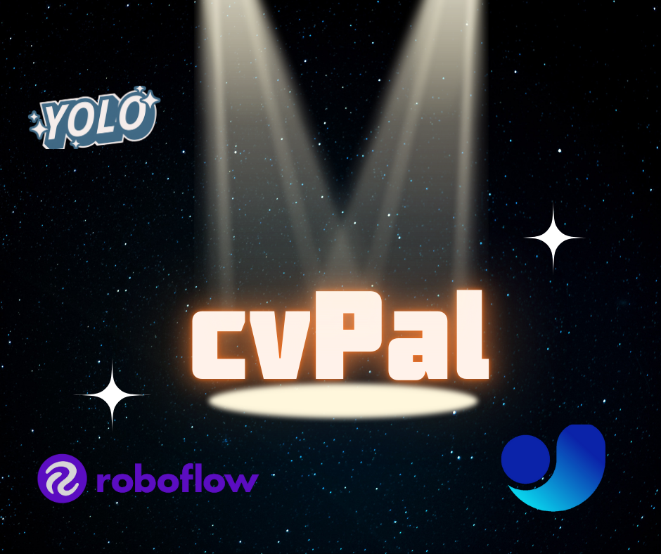

# CvPal 🖼️

<div align="center">



[](https://badge.fury.io/py/cvpal)
[](https://opensource.org/licenses/MIT)
[](https://colab.research.google.com/drive/1D_MNu3Z4lQYErs3wdYbsG4GVOU-p2ywF?usp=sharing)

[](https://github.com/Muhamed555/CvPal/tree/main/documentation)

</div>

## 🌟 Introduction

Welcome to **CvPal** - Your Ultimate Computer Vision Companion! 🚀

**CvPal** is a cutting-edge Python package designed to empower Computer Vision engineers worldwide. Our mission is to streamline image operations, dataset management, and synthetic data generation, allowing you to focus on what truly matters: building and optimizing your machine learning pipelines.

🏆 **Proudly Sponsored by VisionFullSpace** 🏆

## 🎯 Features

- 🖼️ **Synthetic Image Generation**: Create custom datasets using text prompts
- 🔄 **Dataset Merging**: Seamlessly combine datasets with multiple attributes
- 🗑️ **Label Management**: Effortlessly remove or replace specific labels from your dataset
- 📊 **Label Occurrence Counting**: Accurately track label frequencies
- 📝 **Dataset Reporting**: Generate comprehensive reports on your dataset
- 🔌 **Easy Integration**: Smoothly integrate with existing ML pipelines
- 📚 **Comprehensive Documentation**: Detailed guides for all features
- 🤖 **AI-Powered Dataset Creation**: Generate entire datasets with just a prompt
- 🐼 **Pandas Integration**: Group images and labels into a pandas DataFrame for advanced manipulation

## 📁 Dataset Folder Structure

For optimal performance, please structure your dataset folder as follows:

```
folder/
├── train/
│   ├── images/
│   └── labels/
├── test/
│   ├── images/
│   └── labels/
└── valid/
    ├── images/
    └── labels/
```

For TXT format datasets, include a `data.yaml` config file:

```
folder/
└── data.yaml
```

Example `data.yaml`:

```yaml
names:
  - Old_Paper
  - Rock
  - Scissors
nc: 3
roboflow:
  license: Private
  project: rock-paper-scissors-sxsw
  url: https://universe.roboflow.com/roboflow-58fyf/rock-paper-scissors-sxsw/dataset/14
  version: 14
  workspace: roboflow-58fyf
test: ../test/images
train: Rock-Paper-Scissors-SXSW-14/train/images
val: Rock-Paper-Scissors-SXSW-14/valid/images
```

## 🚀 Installation

Install CvPal with a simple pip command:

```bash
pip install cvpal==1.0.0
```

## 🔧 Example Usage

```python
from cvpal.generate import DetectionDataset
from cvpal.preprocessing import ImagesDetection

# Generate synthetic data
detection_dataset = DetectionDataset(model="stable-diffusion")
detection_dataset.generate("a cat looking at the camera", num_images=2, labels=["cat"], output_type="yolo", overwrite=False)

# Preprocess existing dataset
cp = ImagesDetection()
cp.read_data("/content/Rock-Paper-Scissors-SXSW-14", data_type="txt")
cp.report()
```

## 📊 Supported Models and Formats

| Model Name                  | Supported Format | Support in Package | Detection | Segmentation |
|-----------------------------|------------------|---------------------|-----------|--------------|
| YOLOv5-v11                  | TXT & YAML config | ✅ | ✅ | ✅ |
| YOLOv3-v4                   | Darknet TXT | ❌ | ❌ | ❌ |
| EfficientDet                | Pytorch JSON annotations | ❌ | ❌ | ❌ |
| Detectron 2                 | JSON annotations | ❌ | ❌ | ❌ |
| Segmentation Models         | XML format | ❌ | ❌ | ❌ |
| TensorFlow Object Detection | Binary format | ❌ | ❌ | ❌ |
| Fine-tune PaliGemma         | JSONL annotations | ❌ | ❌ | ❌ |
| Apple's CreateML            | Proprietary JSON format | ❌ | ❌ | ❌ |
| Turi Create tools           | Proprietary JSON format | ❌ | ❌ | ❌ |

## 🤝 Call for Contributions

Join the CvPal community and make a global impact! We welcome contributions of all sizes:

- 🐛 Bug fixes and enhancements
- 📝 Documentation improvements
- 🎨 UI/UX enhancements
- 🧪 New feature development

To contribute major changes, please reach out through our mailing list first.

Other ways to contribute:
- 🔍 Help triage issues
- 📚 Create tutorials and presentations
- 🕵️ Review pull requests

## 📄 License

This project is licensed under the MIT License - see the [LICENSE](LICENSE.txt) file for details.

---

<div align="center">
  <strong>Powered by VisionFullSpace</strong><br>
  Empowering Computer Vision Worldwide
</div>